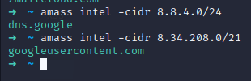

# Methodology for wide scope enumeration

*Phases*
-  ASN and CIDR Enumeration
-  Top-level Domain Enumeration
-  Subdomain Enumeration
    -  HTTP Resolution and Crawling
    -  Cert Enumeration
    -  Github Crawling
-  IIS Discovery
-  Common Service Discovery
-  Default Credential Testing
-  Full Port Scanning *Caution*
-  Vulnerability Scanning *Caution*
-  Github Dorking

*Application Analysis*
- Fetch headers and roots

Disclaimer:
For the purposes of this writeup, the target will be Google which has a public bugbounty program. Only perform these actions on targets with public programs or with expressed permission. 

## ASN & CIDR Enumeration.

Autonomous Systems Numbers (ASNs) are unique identifiers, usually 16-bit in length, allocated to major businesses or corporations. Typically, a company is assigned a single ASN which is associated with their public IP ranges. To investigate these, tools such as Whois, IPGeolocation, and IPInfo are used for accessing public records. Given the limited supply of ASNs (around 65,000), some companies opt to house their entire public infrastructure on cloud services, thus not possessing a distinct ASN but rather falling under the cloud provider's range. For instance, Indeed.com doesn't have its own ASN; it utilizes CloudFlare's Public IP ranges instead. In such scenarios, focusing on known top-level domains for enumeration and bypassing ASN enumeration is often more effective.

If you do have a valid ASN number for a company, check out the following sites. These will give CIDR ranges and top-level domain names associated with the ASN.

Google's ASN:AS15169

```
https://whois.ipinsight.io/AS15169
https://ipgeolocation.io/browse/asn/AS15169
https://ipinfo.io/AS15169

```


## Top-level Domain Enumeration

For Top-level domain enumeration, it is best to use the ASN, CIDR, or company name with tools such as Amass. Personally, I prefer to use CIDR ranges to find all top level domains associated with a public ip range. We can take one of the ranges found with the Whois data and use it with Amass:

```
amass intel -cidr [RANGE]
```



This enumeration can also be done manually through Whois and other ASN lookup sites. Use a combination of techniques and tools when trying to discover top-level domains.

## Subdomain Enumeration
### Overall:

To identify all potential websites and services, we should conduct subdomain discovery on the primary domain names. The most effective approach involves utilizing automated tools that facilitate the discovery process. These tools typically engage in various tasks, such as executing DNS queries, conducting zone transfers, utilizing Google dorking techniques, performing Whois searches, and checking the Wayback Machine. My tools of choice for this task are Amass, Subfinder, and Assetfinder. Collectively, these tools are highly capable of uncovering a vast array of subdomains through both passive and active discovery methods. While it's feasible to use just one tool, I've noticed that each tool tends to reveal slightly different subdomains based on my experience. Plus....requests are free. 

```
subfinder -d [DOMAIN] -silent
```


### HTTP Resolution and Crawling

Having compiled an extensive list of subdomains, our next step in the enumeration process is to identify active HTTP services operating on these subdomains. It's important to remember that our current list only includes subdomains that were active at some point, with no assurance that they are currently hosting services. For detecting active HTTP services, I typically use a tool named Httprobe, developed by Tomnomnom. This tool executes GET requests on the standard HTTP and HTTPS ports and reports back the hosts that respond. It's worth mentioning, though, that Httprobe might not detect HTTP services running on non-standard ports, and uncovering these usually requires port scanning, which will be performed in a later process.

```
cat subdomains.txt | httprobe 
```

Additionally, it should be obvious by now how you could chain the output of these tools. For example it is possible to write the output of Subfinder into a file and also send it directly to Httprobe.The command below will write all unique subdomains to subdomains.txt and perform Http probe on them.

```
subfinder -d [DOMAIN] -silent | anew subdomains.txt | httprobe | anew hosts.txt
```


Important: "Anew," created by Tomnomnom, is a utility designed to process the standard output from various tools. It uniquely appends all inputs to a specified file while also directing them to the standard output. This functionality allows "Anew" to seamlessly integrate with other tools in a chain.

We've compiled a substantial list of active HTTP services, and the next step is to scan these sites for mentions of other subdomains that fall within our scope. My tool of choice for this task is Hakrawler, developed by Hakluke. Hakrawler excels in examining source code and Javascript files to identify domain references, displaying these findings via standard output. By analyzing these outputs, we can uncover more domains related to our scope. The following code is designed to traverse all the listed hosts to locate URLs belonging to the same root domain. Subsequently, it organizes and stores this new data in the same format as our existing records.
```
cat hosts.txt | hakrawler -insecure -subs -u -d 5 | unfurl format $s://$d | grep [DOMAIN]
```

### Cert Enumeration

With our extensive list of verified HTTP services in hand, we can delve deeper into subdomain enumeration by examining SSL/TLS Certificates. These certificates, commonly employed for securing various domains and subdomains, often contain references to the scope within the certificate itself. By analyzing these certificates, we can identify subdomains that were previously undiscovered. While there are tools like Amass for this purpose, I prefer utilizing the SSL templates provided by Nuclei. The code snippet below might appear complex at first glance, but its function is straightforward: it processes the output from Nuclei, extracting and presenting only the subdomains in a format that's easy to use.

```
nuclei -l hosts.txt -t ssl/ssl-dns-names.yaml -silent | grep -oP '[a-zA-Z0-9.-]+\.[a-zA-Z]{2,}' | sed 's/^\.//' | grep [DOMAIN] | anew subdomains.txt

nuclei -l hosts.txt -t ssl/wildcard-tls.yaml -silent | grep -oP '[a-zA-Z0-9.-]+\.[a-zA-Z]{2,}' | sed 's/^\.//' | grep [DOMAIN] | anew subdomains.txt
```


### Github Crawling

It is also common practice to scrape Github for references to subdomains within scope. To do this we can use github-subdomains. This tool takes a domain and a github API token and scrapes the site for references to our domain. This can be done manually with Github Dorking but using a tool like this makes life easier. 

```
github-subdomains -d [DOMAIN] -raw -t [token] | grep [DOMAIN] | anew subdomains.txt
```
This command will add to the list of subdomains we have. By now you have probably realised that we are discovering HTTP hosts and subdomains at the same time. This is why it is import to perform this process recursively.

## IIS Discovery

IIS server discovery is a key part of my enumeration process. Why? Well there is a lot of research indicating that if you can find a LFI vulnerablility then you can almost always get RCE. IIS servers are also vulnerable to shortname scanning. This allows us to read the the short names of the directory where the server is hosted. We can do this recursively for all sub-directories too. I recommend checking out Shub's tutorials on IIS shortname scanning. To discover IIS servers I use my custom Nuclei template.

```
nuclei -l [HOSTS] -t "./CustomTemplates/enhanced-iis-discovery.yaml" -rl 100 -silent
```

## Common Service Discovery

At this stage, we've identified numerous subdomains and HTTP services within our target scope. However, servers host a variety of services beyond HTTP, such as FTP, SSH, Telnet, SQL Servers, RDP, and more. In the era of automated scanners, some might question the value of manually checking for these services, but it's always beneficial to be thorough. For port scanning, my preferred tool is Masscan. The development team behind Masscan innovated by creating a custom TCP/IP stack, significantly speeding up the scanning process while maintaining compatibility with Nmap's arguments. It's crucial to note that aggressive scanning can inadvertently cause server disruptions, so it's important to always conduct scans at a controlled rate, respecting the guidelines and limits of the given scope.

```
ports="21,22,23,66,80,81,443,445,457,1080,1100,1241,1352,1433,1434,1521,1944,2301,3000,3128,3306,4000,4001,4002,4100,5000,5432,5800,5801,5802,6346,6347,7001,7002,8000,8080,8443,8888,30821,139,11211,110,25,3389,5900"

sudo masscan [CIDR] -p $ports -oG [OUTPUT-FILENAME]
nmap -T4 -F -sV [CIDR] -p $ports -oG [OUTPUT-FILENAME] 
```

You can expand this to include all ports. Please respect rate limiting criteria. 

## Default Credential Testing

Now we have a bunch of valid open ports we can automate the process testing these services for default credentials. The reason why we saved the nmap results in the -oG format is so we can feed it into a tool called BruteSpray. This is a tool designed to quickly find services with default usernames and passwords such as admin:admin. Whilst this tool can take large wordlists, do not use long lists for bruteforcing. This is out of scope for most bugbounty platforms and generates a lot of traffic.

```
brutespray -f [NMAP-FILE]
```

## Github Dorking

To perform Github dorking quickly, run gitDorks.sh to create a wordlist of Github searches for manual review. 
```
[USAGE]
./gitDorks [DOMAIN] [COMPANY] [GIT-API-TOKEN]
```

# Application Analysis

Now that our enumeration is out of the way it is time to start wise scope analysis. This phase is designed to find interesting data for further investigation. However, if you prefer to investigate each host 1 at a time then ignore this section and get to work. 

## Fetch Headers and Roots

When beginning this phase I like to query every host from the hosts.txt file and save their html and header responses. To do this I use a tool called Fairly Fast Fetcher (FFF) and Grep Fast (GF) by Tomnomnom. This tool outputs 
